# Impact-of-Latitude-on-Weather-Analysis
 

   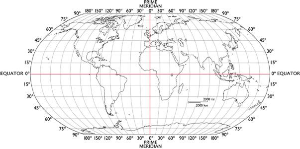

## Summary ##
### Part 1 - Weather Analysis

This project explored how latitudinal position affects weather in regards to maximum temperature (F), humidity (%), cloudiness (%), and wind speed (mph). Using the Python library CitiPy, a randomized data set of over 500 cities globally was compiled. The cities are of varying distance from the equator. A weather check on each city was performed using a series of successive API calls from the OpenWeatherMap API in order to create a representative model of weather across the world. 

From this data set, a series of scatter plots was created using Matplotlib in order to visualize the data. Cities were then separated into Northern and Southern Hemisphere groups, and Python libraries NumPy and SciPy were then used to run linear regression to determine whether a correlation existed between city latitude and any of the four weather characteristics.   

### Part 2 - Vacation Analysis

A list of ideal vacation spots around the world was then generated by performing an analysis on the data from Part 1. Initially, a global heatmap of the cities humidity percentage was created using Jupyter-Gmaps. Then ideal weather parameters for temperature, humidity, cloudiness, and wind speed were defined and used to narrow down the data set. The parameters chosen were temperature between 65-78 degrees F, humidity below 50%, cloudiness below 30%, and wind speed below 15 mph.  Google Places API was utilized to find hotel locations within 5000 meters of each ideal vacation spot. A second heatmap with the hotel layer was created for assistance in finding the perfect vacation destination. 

---

## Process ##

### Part 1 - Weather Analysis
#### Generate Cities List
1.  Created a list for holding lat_lngs and cities.
2.  Created a set of random lat and lng combinations.
3.  Identified nearest city for each lat, lng combination; if the city was unique, added it to a cities list.
4.  Printed the city count to confirm sufficient count for study.

#### Perform API Calls
1.  Created starting URL for Weather Map API call.
2.  Created an empty list for city data.
3.  Created counters for record and set counts.
4.  Ran a loop through all the cities in the list.
5.  Grouped cities in sets of 50 for logging purposes.
6.  Create endpoint URL with each city.
7.  Logged the URL, record, and set numbers.
8.  Ran an API request for each of the cities.
9.  Parsed the JSON and retrieved data.
10. Parsed out the max temp, humidity, cloudiness, and wind speed.
11. Appended the city information into city_data list.

#### Data Cleanup and Analysis
1.  Converted array of JSONs into Pandas DataFrame.
2.  Viewed record count to ensure more than 500 cities.
3.  Displayed dataframe and checked statistics.
4.  Created a dataframe with the indices of cities that have humidity over 100%.
5.  Made a new dataframe equal to the city data to drop all humidity outliers by index.
6.  Extracted relevant fields from the dataframe.
7.  Exported the City_Data into a CSV file.

#### Latitude Analysis
1.  Built scatter plot for latitude vs. temperature. 
2.  Built scatter plots for latitude vs. humidity. 
3.  Built scatter plots for latitude vs. cloudiness.
4.  Built scatter plots for latitude vs. wind speed. 

#### Linear Regression Analysis by Hemisphere
1.  Created a function to create Linear Regression plots.
2.  Created Northern and Southern Hemisphere dataframes.
3.  Plotted linear regression for max temp versus latitude for northern hemisphere.
4.  Plotted linear regression for max temp versus latitude for southern hemisphere.
5.  Plotted linear regression for humidity versus latitude for northern hemisphere.
6.  Plotted linear regression for humidity versus latitude for southern hemisphere.
7.  Plotted linear regression for cloudiness versus latitude for northern hemisphere.
8.  Plotted linear regression for cloudiness versus latitude for southern hemisphere.
9.  Plotted linear regression for wind speed versus latitude for northern hemisphere.
10. Plotted linear regression for wind speed versus latitude for southern hemisphere.

### Part 2 - Vacation Analysis
#### Humidity Heatmap for Cities in Part 1
1.  Stored CSV created in part one into a dataframe.
2.  Configured gmaps.
3.  Created heatmap of humidity.

#### Create new DataFrame fitting weather criteria
1.  Narrowed down dataframe to find ideal weather conditions (max temp between 65 and 78, humidity below 50%, cloudiness below 30%, & windspeed below 15 mph).

####  Hotel Analysis
1.  Created dataframe to store hotel names along with city, country and coordinates.  
2.  Set parameters to search for a hotel.
3.  Created list of lat and lng from cities data.
4.  Used the search term: "Hotel" and the lat/lng on Google Maps.
5.  Made requests and printed URLs.
6.  Converted to JSON.
7.  Got first hotel from the results and stored the names.
8.  Used a template to add the hotel marks to the heatmap.
9.  Added marker layer on top of heat map. 

---

## Analysis ##
As observed in the scatter plots below, the maximum temperature of cities increases as they are located closer to the equator. Interestingly, the cities with the highest maximum temperature are between 20 to 40 degrees latitude which could be attributed to the Earth's axis tilt in relation to the sun during the month of July. This strong correlation was reflected in both hemispheres in relatively high r-values as well.

The percentages of humidity appear to be much more clustered in a 60% and higher range as cities are located closer to the equator. However, the poor r-value suggests a weak correlation between the two variables.

Both cloudiness and wind speed displayed no relationship to latitude. This was reflected in the extremely low r-value for both variables in each hemisphere.

---

## Scatter Plots ##

   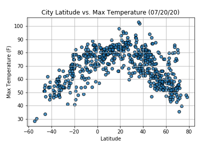
   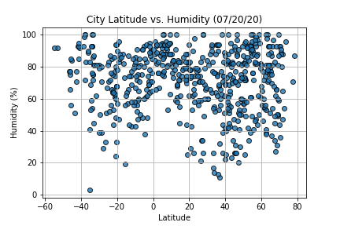

   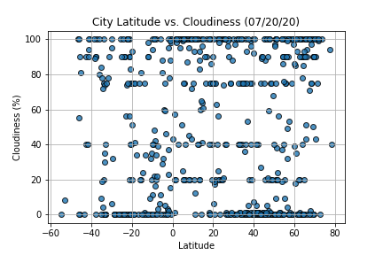
   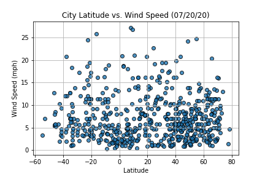

#### Max temperature increases as the cities are located closer to the equator and nearly all of the cities that are located close to the equator have a high percentage of humidity (> 60%). However, there appears to be no relationship between the latitude and cloudiness or wind speed.

---

## Linear Regression ## 
### Max Temperature versus Latitude

   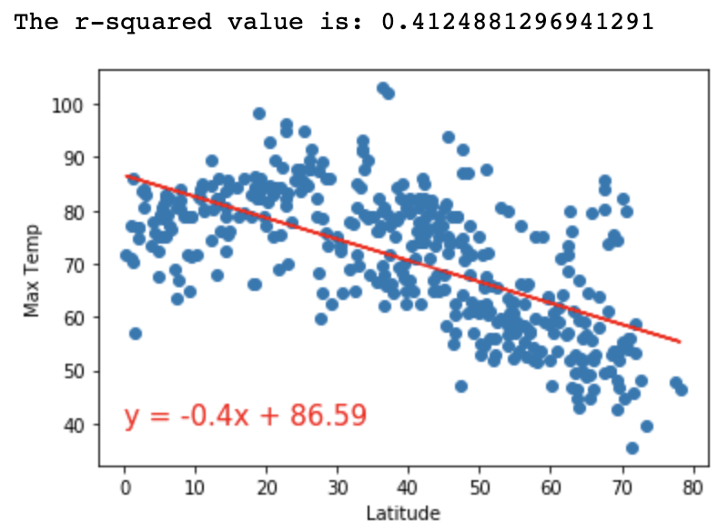
   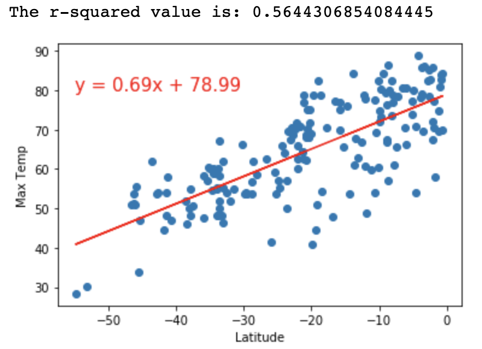

#### Both the Northern and Southern Hemispheres share relatively high r-values which indicates a positive correlation between max temperature and latitude. This suggests that as latitude approaches zero, max temperature increases.

### Humidity versus Latitude

   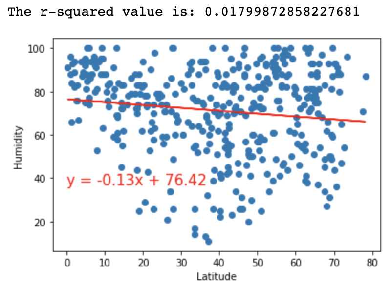
   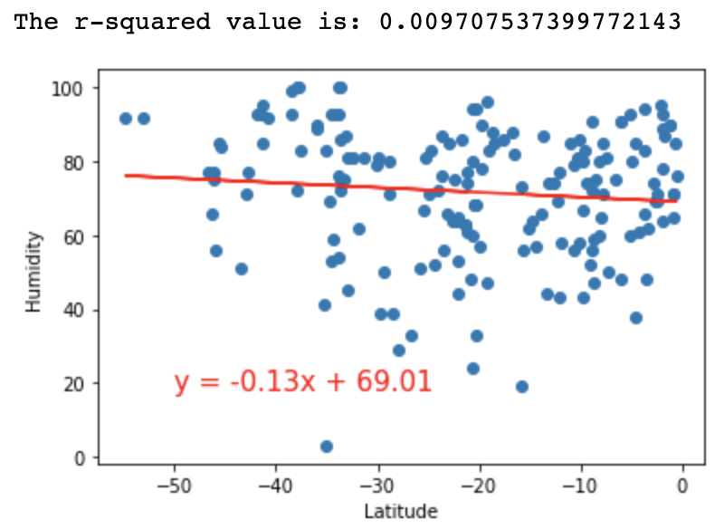

#### Both hemispheres have weak r-values which indicates no apparent relationship between humidity and latitude.

### Cloudiness versus Latitude

   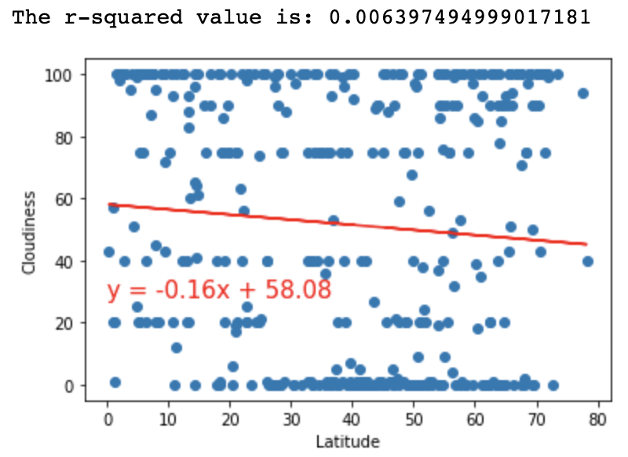
   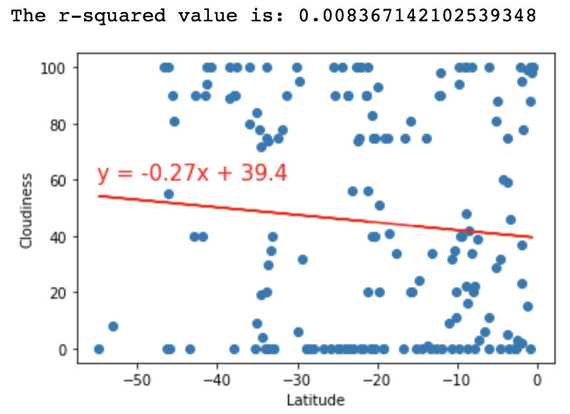

#### Again, r-values for both hemispheres are extremely low which indicates no relationship between cloudiness & latitude.

### Wind Speed versus Latitude

   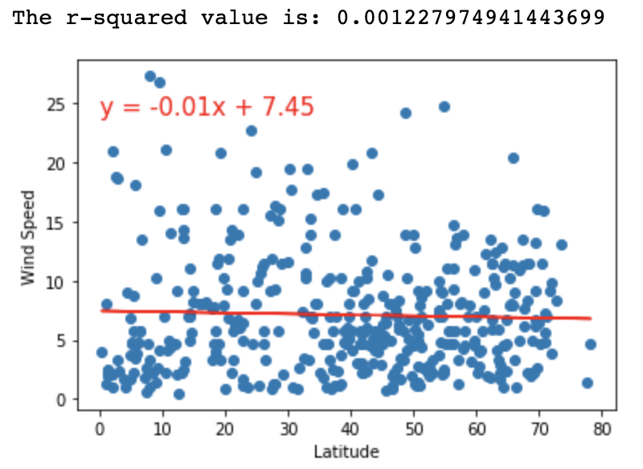
   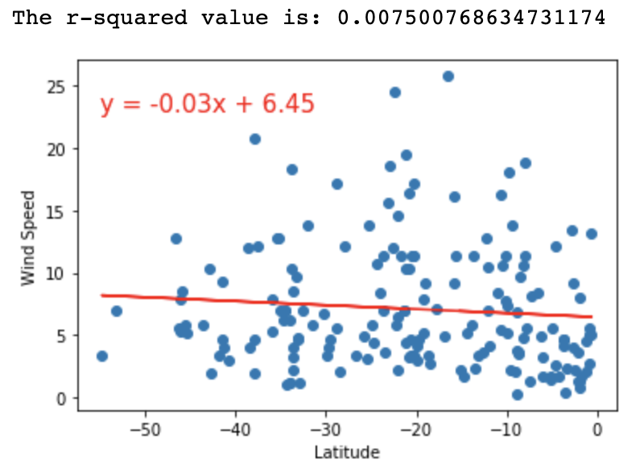

#### The extremely low r-values for both hemispheres indicates no relationship between wind speed and latitude.

---
## Humidity Heatmap ##

   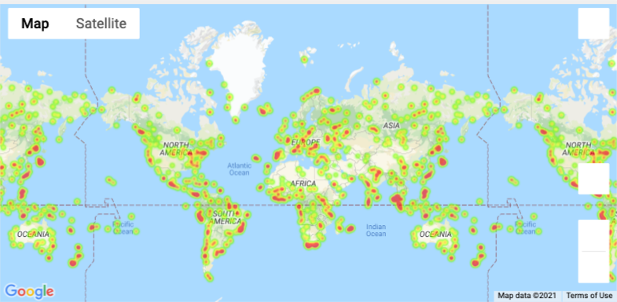

## Humidity Heatmap with Ideal Vacation Destinations Hotel Layer ##

   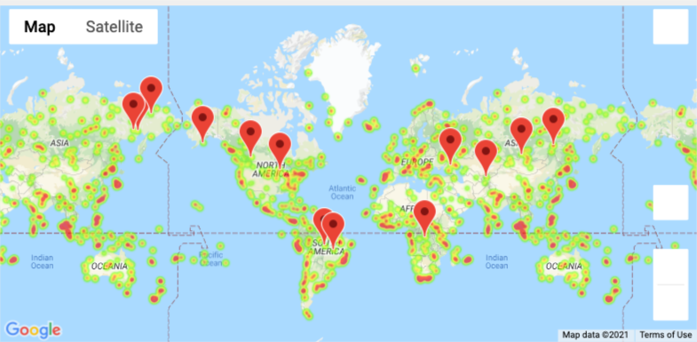

---

## Sources ##
Data
* [Cities CSV](https://github.com/kiranrangaraj/Impact-of-Latitude-on-Weather-Analysis/blob/main/output_data/cities.csv)

References
* [Open Weather Map API](https://openweathermap.org/api)
* [Google Places API](https://developers.google.com/places/web-service/overview)

---

## Technologies Used ##
* Jupyter Notebook
* Python - Pandas, Matplotlib, NumPy, SciPy, CitiPy, Gmaps, OS, Requests

---

## Author ##
Kiran Rangaraj - LinkedIn: [@Kiran Rangaraj](https://www.linkedin.com/in/kiranrangaraj/)
